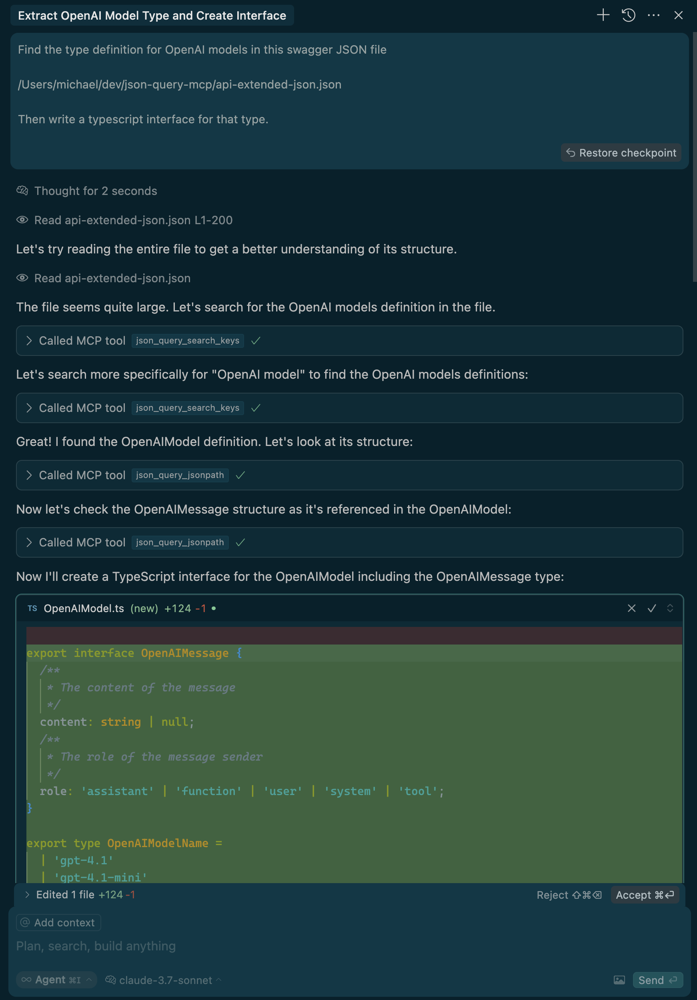

# JSON Query MCP

A Model Context Protocol (MCP) server for querying large JSON files.
This server provides tools for working with large JSON data that can be used by LLM models implementing the [Model Context Protocol](https://modelcontextprotocol.io).

## Features

- Query JSON files using JSONPath expressions
- Search for keys similar to a query string
- Search for values similar to a query string

## Example

Here is an example of the Cursor Agent using the tool to read a a very large (>1M character) JSON Swagger
definition, and extracting a small portion to write a typescript interface.



## Usage

npx json-query-mcp

## Installation in Cursor

Add the following to your cursor mcp json
(on macOS this is `/Users/$USER/.cursor/mcp.json`)

```mcp.json
{
  "mcpServers": {
    ... other mcp servers
    "json-query": {
      "command": "npx",
      "args": [<local path to this repo>],
    },
  }
}
```

## Development

```bash
# Run in development mode
npm run dev

# Run tests
npm test

# Format code
npm run format

# Lint code
npm run lint

# Fix lints
npm run fix
```

## License

MIT
